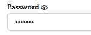
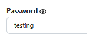

# Password Revealer Chrome Extension

**Password Revealer** is a simple and effective Chrome extension that allows users to reveal password inputs as plain text by clicking on them. This functionality can be toggled on or off through a popup menu.

## Features 

- **Toggle Password Visibility**: Click on any password input field to switch between password and plain text.
- **User-Friendly Interface**: Easily enable or disable the password reveal functionality using a simple toggle button in the extension's popup.
- **Seamless Integration**: The extension works on all web pages, making it ideal for testing and debugging web forms.

## Screenshots

| Password Field Hidden | Password Field Revealed |
|-----------------------|-------------------------|
|  |  |

## Installation

To install the **Password Revealer** extension from your local machine:

1. **Clone or Download** the repository to your local machine.

```
git clone https://github.com/anasmir/PasswordRevealerChromeExtension.git
```

2. Open **Google Chrome** and navigate to chrome://extensions/.
3. Enable **Developer Mode** (toggle in the top right corner).
4. Click on **Load Unpacked** and select the folder where you cloned/downloaded the repository.
5. The extension will now be visible in your Chrome extensions bar.

## How to Use

1. After installation, click on the **Password Revealer** icon in the Chrome toolbar to open the popup.
2. Toggle the switch to **Enable** or **Disable** password reveal functionality.
3. When enabled, open any website (refresh if already opened) then wait for 3 seconds then click on any password input field on a webpage to reveal its value.

## Files Overview

`manifest.json`
Defines the Chrome extension's manifest, including permissions, content scripts, and the popup.

`content.js`
Handles the functionality of finding password fields and toggling their visibility when clicked.

`popup.html`
Contains the user interface for the popup that allows enabling or disabling the password reveal feature.

`popup.js`
Handles the toggle switch in the popup and saves the user’s preferences using Chrome’s storage.


# Learn More
To learn how to develop this extension yourself, follow the tutorial in [this YouTube video](https://www.youtube.com/@Elitechsol).
